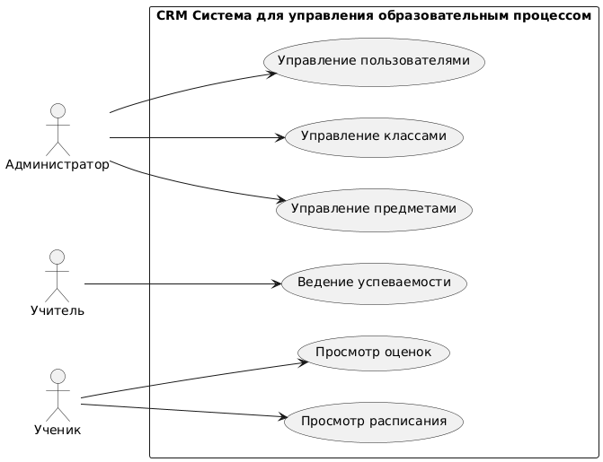

### Требования к структуре

- Управление пользователями: обеспечивает добавление, редактирование и удаление пользователей.
- Управление классами: осуществляет добавление, редактирование и удаление классов.
- Управление предметами: осуществляет добавление, редактирование и удаление предметов.
- Ведение успеваемости: обеспечивает добавление, редактирование и удаление оценок.

### Требования к функциям

- Управление пользователями. Результат: возможность администратору добавлять, редактировать и удалять пользователей.
- Управление классами. Результат: возможность администратору добавлять, редактировать и удалять классы.
- Управление предметами. Результат: возможность администратору добавлять, редактировать и удалять предметы.
- Ведение успеваемости. Результат: возможность учителям добавлять, редактировать и удалять оценки.

### Требования к видам обеспечения

- Данные представлены в виде документов, где каждый документ представляет собой пользователя, его классы, предметы и успеваемость.
- Применяется документоориентированная база данных для хранения информации о пользователях, реляционная база данных для хранения информации об успеваемости.

### Технические требования

- Безопасность: защита данных пользователей и системы.
- Масштабируемость: возможность горизонтального масштабирования.
- Удобство использования: интуитивно понятный интерфейс для всех категорий пользователей.